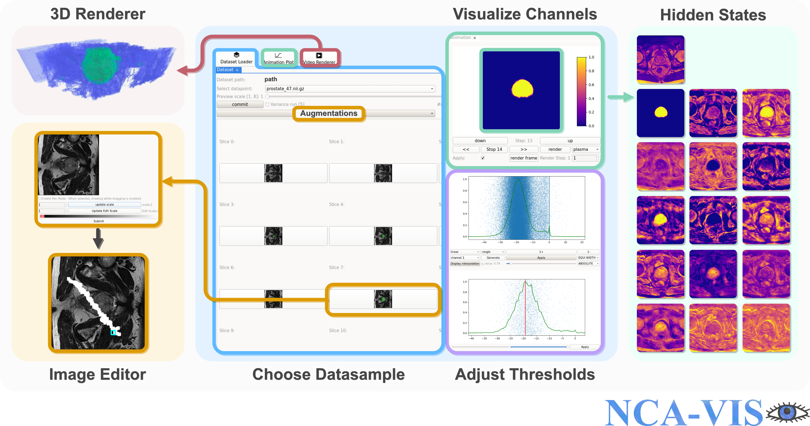

# MED-NCA: Bio-inspired Medical Image Segmentation

This repository provides the NCA-VIS tool for visualizing inference results from 2D and 3D MED-NCA models. It includes pretrained models for 3D Prostate Segmentation and 2D BUID Segmentation.

<div>

</div>

---
## Quick Start
### 1. Set Up Environment

Create the environment using:
    conda env create -f env.yml


### 2. Download Data

BUID Dataset: https://www.kaggle.com/datasets/aryashah2k/breast-ultrasound-images-dataset

Prostate Dataset: http://medicaldecathlon.com/

Place data in:
data/dataset/imagesTr
data/dataset/labelsTr

! Image and label need to have the same name

---
### 3. Run the Visualization App

Start the application with:
    python vis_m3d_prostate.py
    python vis_med_us_breast.py

---
### 4. Use the Tool

- Load a scan using the **Load** button.
- Edit slices if desired.
- Run inference by clicking **Commit**.
- Adjust visualization settings like channel, intensity range, color maps, etc.
- Render outputs as images or GIFs.

---

## More Info

For a detailed walkthrough and screenshots, see the Jupyter notebooks:
- `vis_m3d_nca_prostate.ipynb`
- `vis_med_nca_BUID.ipynb`

---
## Notes

- Sample data and pretrained model are included.
- GPU is optional, but speeds up inference.

## Cite

```
@article{kalkhof2025med,
  title={MED-NCA: Bio-inspired medical image segmentation},
  author={Kalkhof, John and Ihm, Niklas and K{\"o}hler, Tim and Gregori, Bjarne and Mukhopadhyay, Anirban},
  journal={Medical Image Analysis},
  pages={103601},
  year={2025},
  publisher={Elsevier}
}